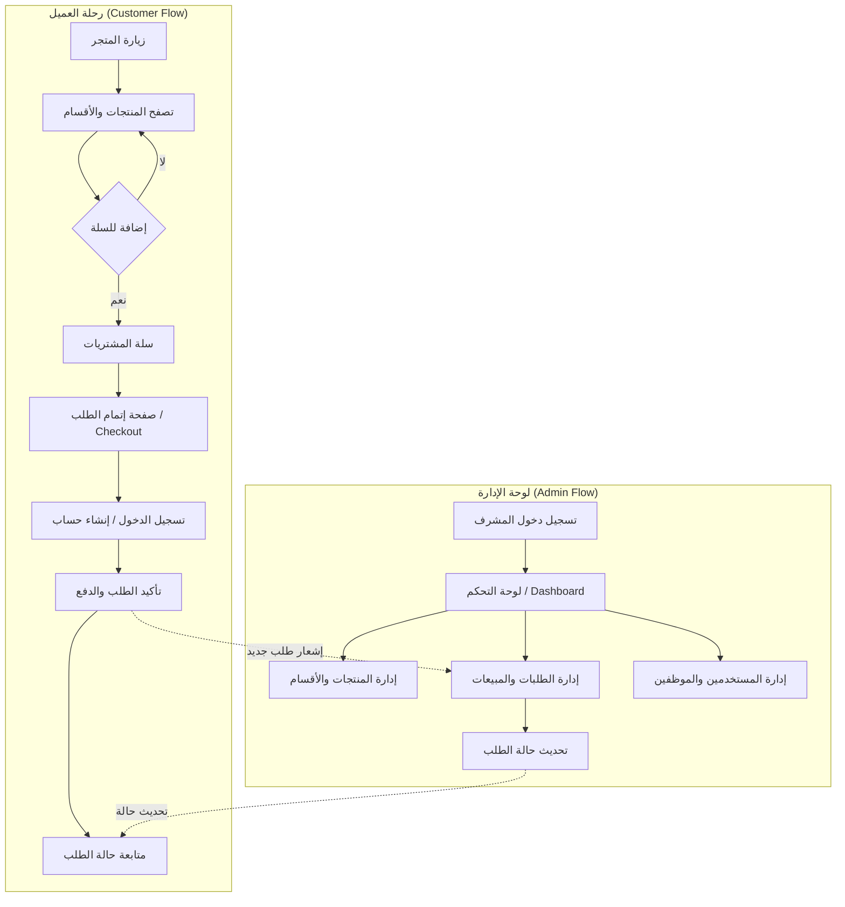
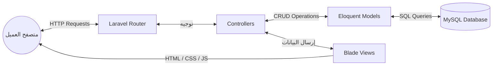

<div dir="rtl">

# 🛍️ متجر ريتال ستور (RETAL STORE) — منصة تجارة إلكترونية متكاملة

<p align="center">
  <em>Full-Stack E-Commerce Platform | Laravel 12 + Blade + TailwindCSS</em>
</p>

<p align="center">
  
  
  
  
  
  
  
  
</p>

---

### 🌐 المعاينة الحية والمستودع / Live Preview & Links

* 🔗 **مستودع الكود (GitHub Repository)**: [https://github.com/tmsaah770/Rital-Store](https://github.com/tmsaah770/Rital-Store)

---

### 📖 جدول المحتويات / Table of Contents

1. [نبذة عن المشروع (Overview)](#1-نبذة-عن-المشروع--overview)
2. [خريطة سير العمل والرحلة الرقمية (Workflow Map)](#2-خريطة-سير-العمل-والرحلة-الرقمية--workflow-map)
3. [الهيكل المعماري للنظام (System Architecture)](#3-الهيكل-المعماري-للنظام--system-architecture)
4. [الميزات والخصائص الشاملة (Key Features)](#4-الميزات-والخصائص-الشاملة--key-features)
5. [التقنيات المستخدمة (Tech Stack)](#5-التقنيات-المستخدمة--tech-stack)
6. [مسارات النظام الأساسية (System Routes)](#6-مسارات-النظام-الأساسية--system-routes)
7. [هيكل المجلدات (Project Directory Structure)](#7-هيكل-المجلدات--project-directory-structure)
8. [دليل التشغيل المحلي (Getting Started)](#8-دليل-التشغيل-المحلي--getting-started)
9. [معايير الأمان وجودة الكود (Security & Best Practices)](#9-معايير-الأمان-وجودة-الكود--security--best-practices)
10. [المطور (Developer)](#10-المطور--developer)

---

### 🌟 1. نبذة عن المشروع / Overview

**متجر ريتال ستور (RETAL STORE)** هو تطبيق تجارة إلكترونية متكامل (Full-Stack) مخصص لعرض وبيع المنتجات بشكل احترافي، يجمع بين واجهة مستخدم أمامية أنيقة وجذابة مبنية باستخدام قوالب Laravel Blade وتنسيقات Tailwind CSS العصرية، وخلفية برمجية قوية مبنية بإطار عمل Laravel 12. يعتمد النظام على بنية MVC القوية لتوفير أداء عالٍ واستجابة سريعة.

تم تصميم المنصة لتمنح العميل تجربة تسوق سلسة وسريعة مع أدوات إدارة شاملة تتيح للمشرفين التحكم في المخزون، الطلبات، العملاء، ومتابعة إحصائيات المبيعات بلحظة.

---

### 🗺️ 2. خريطة سير العمل والرحلة الرقمية / Workflow Map

توضح الخريطة التالية الرحلة الرقمية الكاملة داخل المتجر لكلا الطرفين: العميل (Customer) والإدارة (Admin):



---

### 🏗️ 3. الهيكل المعماري للنظام / System Architecture

يعتمد المشروع على بنية MVC (Model-View-Controller) المدمجة لضمان فصل منطق الأعمال عن واجهة المستخدم وقاعدة البيانات:



---

### ⚡ 4. الميزات والخصائص الشاملة / Key Features

🛍️ **1. ميزات العميل والمتجر (Storefront Experience)**
- **واجهة عصرية:** تصميم متجاوب (Responsive) بالكامل يدعم جميع الشاشات والموبايل باستخدام TailwindCSS.
- **كتالوج المنتجات الذكي:** استعراض المنتجات وتصنيفها مع نظام تفاصيل غني للمنتج وصور متعددة.
- **سلة مشتريات ديناميكية (Interactive Cart):** إضافة وحذف وتعديل الكميات وحساب المجاميع بكل سهولة.
- **بوابة إتمام الشراء (Checkout & Orders):** دورة دفع متكاملة مع إمكانية إدخال تفاصيل الشحن.
- **التتبع عبر واتساب:** ميزة إرسال تفاصيل الطلب وتتبعه بسهولة من خلال الواتساب.
- **نظام حسابات العملاء:** تسجيل دخول وإنشاء حساب للعملاء لتتبع طلباتهم السابقة.

🛡️ **2. لوحة الإدارة والتحكم (Admin Dashboard & Control)**
- **حماية المسارات:** حماية قوية باستخدام أنظمة المصادقة (Middleware) لمنع الوصول غير المصرح به (صلاحيات Employee/Admin).
- **لوحة المؤشرات والإحصائيات:** متابعة إجمالي المبيعات، عدد الطلبات، والمستخدمين المسجلين بشكل لحظي.
- **إدارة المنتجات والأقسام (Products & Categories):** إضافة وتعديل وحذف المنتجات مع رفع الصور، وإدارة الأقسام المتعددة.
- **إدارة الطلبات (Orders Management):** تحديث حالات الطلب (قيد المراجعة، تم الشحن، مكتمل، ملغي) ومتابعة تفاصيل العميل والطلب.
- **إدارة الموظفين والعملاء:** القدرة على إضافة وحذف الموظفين، والتحكم بحسابات العملاء.

---

### 💻 5. التقنيات المستخدمة / Tech Stack

| المجال (Area) | التقنية (Technology) | الوصف والدور |
| --- | --- | --- |
| **Frontend Framework** | **Blade & HTML5** | محرك القوالب الخاص بـ Laravel لبناء واجهات ديناميكية وسريعة |
| **Styling & Design** | **Tailwind CSS v4** | إطار عمل CSS لتصميم واجهات عصرية ومتجاوبة بكفاءة |
| **Bundler & Tooling** | **Vite** | نظام بناء وتجميع سريع مع ميزة Hot Module Replacement |
| **Backend Framework** | **Laravel 12 (PHP 8.2)** | إطار عمل PHP قوي وآمن لبناء منطق التطبيق (MVC) |
| **Authentication** | **Laravel Session Auth** | إدارة جلسات المستخدمين وتسجيل الدخول الآمن للمشرفين والعملاء |
| **Database** | **MySQL (InnoDB)** | قاعدة بيانات علائقية لتخزين المنتجات والطلبات عبر Eloquent ORM |
| **Architecture** | **Monolithic MVC** | بنية النظام المتكاملة (Model-View-Controller) المنظمة والفعّالة |

---

### 🛣️ 6. مسارات النظام الأساسية / System Routes

**1. المسارات العامة (Public Routes):**
| المسار (Endpoint) | الطريقة (Method) | الوظيفة |
| --- | --- | --- |
| `/` | GET | الصفحة الرئيسية للمتجر |
| `/product/{id}` | GET | عرض تفاصيل منتج معين |
| `/cart` | GET | استعراض محتويات سلة التسوق |
| `/cart/add` | POST | إضافة منتج إلى السلة |
| `/checkout` | GET | صفحة إتمام عملية الشراء |
| `/order/submit` | POST | اعتماد الطلب الجديد |

**2. مسارات المصادقة (Auth Routes):**
| المسار (Endpoint) | الطريقة (Method) | الوظيفة |
| --- | --- | --- |
| `/login` | GET/POST | صفحة تسجيل الدخول |
| `/register` | GET/POST | صفحة إنشاء حساب جديد |
| `/logout` | POST | تسجيل الخروج وإبطال الجلسة |

**3. مسارات لوحة تحكم الإدارة (Admin Protected Routes):**
| المسار (Endpoint) | الطريقة (Method) | الوظيفة |
| --- | --- | --- |
| `/admin/dashboard` | GET | لوحة الإحصائيات الرئيسية |
| `/admin/products` | GET/POST/PUT/DEL | إدارة المنتجات (إضافة/تعديل/حذف) |
| `/admin/categories` | GET/POST/PUT/DEL | إدارة التصنيفات والأقسام |
| `/admin/orders` | GET/PUT | استعراض وتحديث حالات الطلبات |

---

### 📁 7. هيكل المجلدات / Project Directory Structure

```text
RETAL-STORE/
├── app/
│   ├── Http/Controllers/  # المتحكمات (Admin, Auth, Cart, Order, Store)
│   └── Models/            # نماذج قاعدة البيانات (User, Product, Category, Order...)
├── bootstrap/             # ملفات تمهيد التطبيق
├── config/                # ملفات إعدادات النظام
├── database/
│   ├── migrations/        # ملفات بناء جداول قاعدة البيانات
│   └── seeders/           # بيانات أولية (Fake Data) للتجربة
├── public/                # الملفات العامة (CSS, JS, Images)
├── resources/
│   ├── css/               # ملفات الإستايل الخاصة بـ Tailwind CSS
│   ├── js/                # ملفات الجافاسكريبت المساعدة
│   └── views/             # قوالب Blade (واجهات العميل + لوحة التحكم)
├── routes/
│   └── web.php            # تعريف جميع مسارات النظام والويب
├── storage/               # ملفات النظام والصور المرفوعة للمنتجات
├── .env                   # متغيرات البيئة السرية
├── composer.json          # حزم واعتمادات النظام الخلفي (Laravel)
├── package.json           # حزم واعتمادات النظام الأمامي (Vite, Tailwind)
└── vite.config.js         # إعدادات مترجم Vite
```

---

### 🚀 8. دليل التشغيل المحلي / Getting Started

**1. المتطلبات المسبقة (Prerequisites):**
- **PHP >= 8.2** مع ملحقات (`pdo_mysql`, `openssl`, `mbstring`)
- **Composer** لإدارة حزم PHP
- **Node.js & npm** لإدارة حزم الواجهة الأمامية
- **MySQL** كخادم قاعدة بيانات

**2. إعداد وتشغيل بيئة التطوير (Installation & Setup):**

```bash
# 1. استنساخ المستودع
git clone https://github.com/tmsaah770/Rital-Store.git
cd Rital-Store

# 2. تثبيت حزم PHP (Laravel)
composer install

# 3. تثبيت حزم الواجهة الأمامية
npm install

# 4. نسخ ملف إعدادات البيئة
cp .env.example .env

# 5. توليد مفتاح التشفير الخاص بالتطبيق
php artisan key:generate

# 6. ربط مجلد التخزين لعرض الصور المرفوعة للمنتجات
php artisan storage:link

# 7. إعداد قاعدة البيانات وتحديثها (تأكد من إنشاء قاعدة بيانات محلياً)
# عدل بيانات قاعدة البيانات داخل ملف .env ثم نفذ:
php artisan migrate --seed

# 8. تشغيل خادم Laravel المحلي
php artisan serve
```

في **نافذة طرفية (Terminal) أخرى**، قم بتشغيل Vite لعمل وتجميع ملفات الواجهة الأمامية:
```bash
npm run dev
```

سيتم تشغيل المتجر افتراضياً على الرابط: `http://localhost:8000`

---

### 🔒 9. معايير الأمان وجودة الكود / Security & Best Practices

1. **حماية الجلسات والمصادقة (Auth & Middleware):** حماية مسارات الإدارة عبر Middleware لضمان عدم دخول أي زائر غير مصرح له للوحة التحكم، وعزل صلاحيات المدير والموظفين.
2. **عزل المتغيرات الحساسة (Environment Isolation):** حظر وتجاهل ملفات `.env` عن طريق `.gitignore` لمنع رفع مفاتيح التشفير وقواعد البيانات إلى المستودع العام.
3. **الوقاية من هجمات الحقن (SQL Injection & XSS):** الاعتماد بشكل كامل على محرك `Eloquent ORM` لحماية قواعد البيانات من الحقن، واستخدام ميزة الهروب التلقائي (Auto-Escaping) في قوالب `Blade` لمنع هجمات XSS.
4. **إدارة ورفع الملفات بأمان:** تخزين صور المنتجات بشكل آمن في مجلد `storage/app/public` وتوليد اختصارات للمجلد لمنع الوصول المباشر للملفات الحساسة في النظام.

---

### 👨‍💻 10. المطور/ Developer 
* محمود أبو طالب (Mahmoud Abotaleb)
* **GitHub:** [@tmsaah770](https://github.com/tmsaah770)

<p align="center">
تم بناء وتصميم هذا المشروع ليكون نموذجاً تطبيقياً متكاملاً يجمع بين الإتقان في هندسة النظم وتصميم واجهات المستخدم الحديثة.
</p>

</div>
